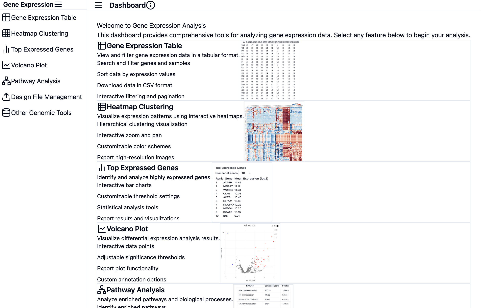
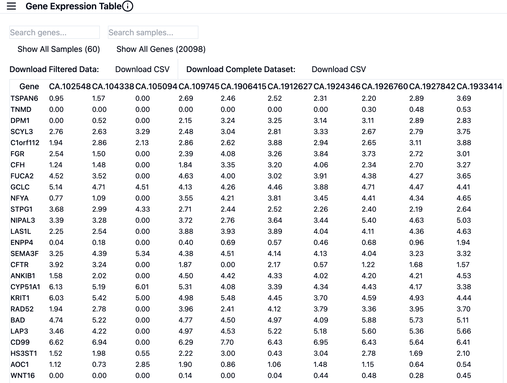
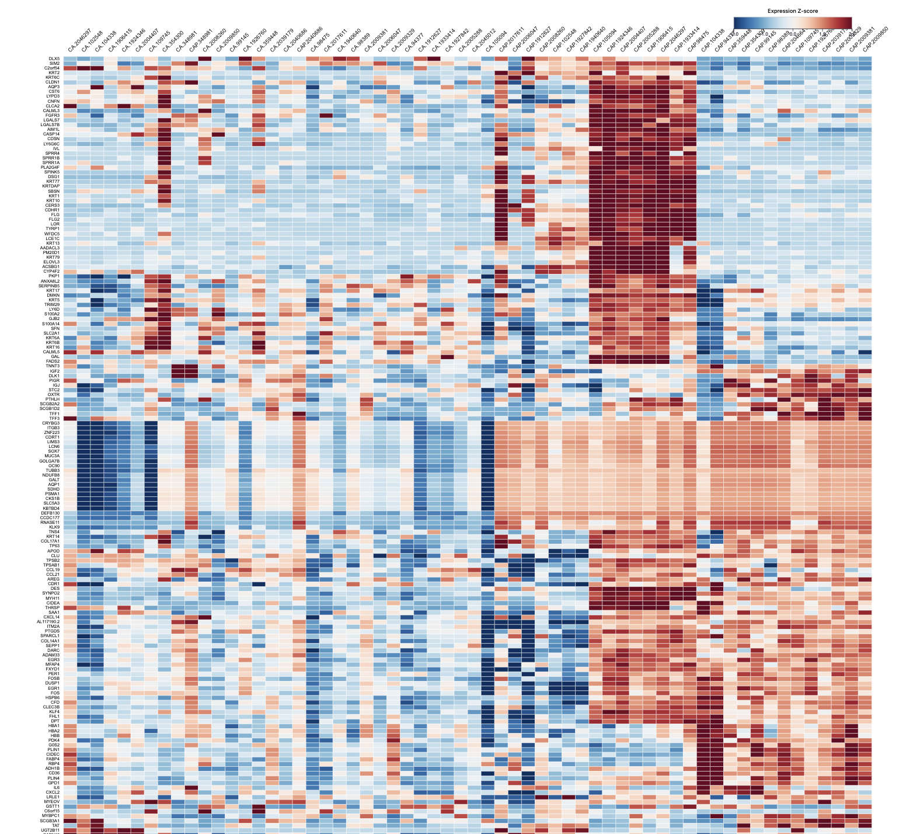
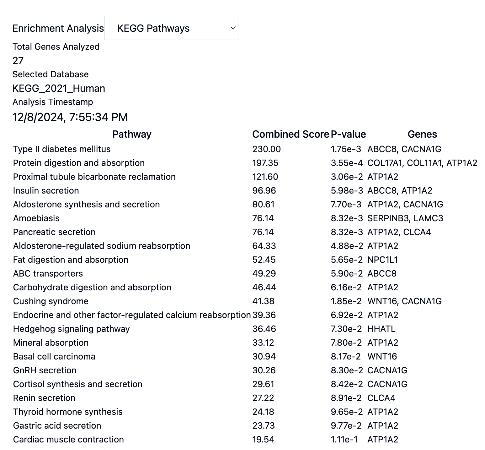
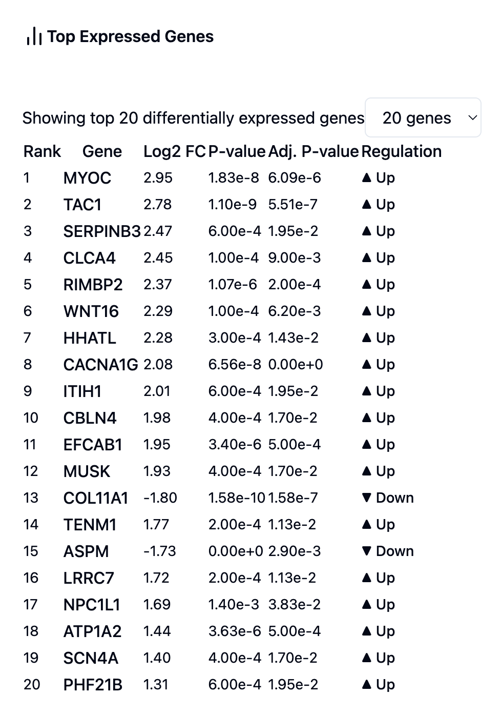

# Genomic Data Dashboard

A comprehensive web application for analyzing and visualizing genomic data, featuring DESeq2 integration, interactive visualizations, and connections to major genomic analysis tools.

## Dashboard Views

### Main Dashboard

The main dashboard provides quick access to all analysis features and tools.

### Gene Expression Table

Interactive table for viewing and filtering gene expression data, with advanced sorting and filtering capabilities.

### Heatmap Clustering

Hierarchical clustering visualization with interactive features and customizable color schemes.

### Pathway Analysis

Analyze enriched pathways and biological processes using multiple genomic tools.

### Top Expressed Genes

Identify and analyze highly expressed genes with statistical significance.

## Features

### Data Analysis
- Raw count data processing and validation
- DESeq2 differential expression analysis
- Statistical analysis with multiple testing correction
- Gene set enrichment analysis

### Interactive Visualizations
- Gene expression tables with advanced filtering
- Hierarchical clustering heatmaps with D3.js
- Volcano plots for differential expression
- Expression bar charts
- Customizable data views and thresholds

### External Tool Integration
- STRING DB (protein interactions)
- DAVID (functional annotation)
- GSEA (gene set enrichment)
- GeneMANIA (gene networks)

### Data Management
- CSV data import/export
- Experimental design file management
- Result caching
- Batch processing support

## Test Dataset

This project uses test data from the Gene Expression Omnibus (GEO) database:

- **Dataset ID**: GSE183947
- **Source**: NCBI GEO Database
- **URL**: [https://www.ncbi.nlm.nih.gov/geo/query/acc.cgi?acc=GSE183947](https://www.ncbi.nlm.nih.gov/geo/query/acc.cgi?acc=GSE183947)

### Data Attribution
The test dataset is sourced from the Gene Expression Omnibus (GEO) database, accession number GSE183947. This data is used for demonstration and testing purposes only. Please refer to the original source for data usage terms and citations.

## Tech Stack

### Frontend
- React 18+
- JavaScript
- Create React App
- Tailwind CSS for styling
- shadcn/ui components
- D3.js and Plotly.js for visualizations
- Recharts for charts
- React Router v6
- Radix UI primitives

### Backend
- Python 3.x
- Flask REST API
- Pandas & NumPy
- SciPy
- R with DESeq2

## Prerequisites

- Node.js 16+
- Python 3.x
- R with Bioconductor
- Git

## Installation

1. Clone the repository:
```bash
git clone https://github.com/KuthuruTejaswini/genomic-data-dashboard.git
cd genomic-data-dashboard
```

2. Set up the backend:
```bash
# Create and activate Python virtual environment
python -m venv venv
source venv/bin/activate  # On Windows: venv\Scripts\activate

# Install Python dependencies
pip install -r requirements.txt

# Install R packages
R
> if (!requireNamespace("BiocManager", quietly = TRUE))
    install.packages("BiocManager")
> BiocManager::install("DESeq2")
> install.packages("jsonlite")
```

3. Set up the frontend:
```bash
# Navigate to frontend directory
cd frontend

# Install dependencies
npm install
```
## Getting Started

1. Start the backend server:
```bash
# From the root directory
flask run
```

2. Start the frontend development server:
```bash
# From the frontend directory
npm start
```

Access the application at `http://localhost:3000`

## Using Your Own Data

1. Prepare your gene expression data:
   - Raw counts matrix in CSV format
   - Experimental design file in CSV format

2. Data format requirements:
   - Raw counts: Genes as rows, samples as columns
   - Design file: Sample names and conditions

Example formats:

Raw counts (`raw_counts.csv`):
```csv
Gene,Sample1,Sample2,Sample3
GENE1,100,150,200
GENE2,50,75,80
```

Design file (`design.csv`):
```csv
sample,condition
Sample1,control
Sample2,treatment
Sample3,treatment
```

## API Endpoints

### Data Upload
```
POST /api/upload/raw_counts
POST /api/upload_design
```

### Analysis
```
GET /api/deseq2
GET /api/clustering
GET /api/top-expressed
GET /api/volcano_plot
POST /api/enrichr_full_analysis
```

## Development

### Available Scripts

Frontend:
- `npm start`: Start development server
- `npm run build`: Build for production

Backend:
- `flask run`: Start Flask server
- `python -m pytest`: Run tests

## Contributing

1. Fork the repository
2. Create your feature branch (`git checkout -b feature/AmazingFeature`)
3. Commit your changes (`git commit -m 'Add some AmazingFeature'`)
4. Push to the branch (`git push origin feature/AmazingFeature`)
5. Open a Pull Request

## License

[MIT License](LICENSE)

## Contact

Your Name - ktejaswini2000@gmail.com

Project Link: [https://github.com/KuthuruTejaswini/genomic-data-dashboard](https://github.com/KuthuruTejaswini/genomic-data-dashboard)

## Acknowledgments

- Test data provided by Gene Expression Omnibus (GEO) - GSE183947
- DESeq2 for differential expression analysis
- shadcn/ui for UI components
- All external tool providers (STRING, DAVID, GSEA, GeneMANIA)